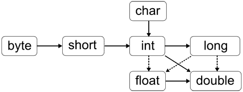

[Преобразование типов в Java](https://docs.oracle.com/javase/specs/jls/se15/html/jls-5.html) это достаточно большая тема, но мы постараемся рассмотреть ее компактно и вместе с тем как можно более полно. Частично мы уже касались этой темы.

В Java возможны преобразования между целыми значениями и значениями с плавающей точкой. Кроме того, можно преобразовывать значения целых типов и типов с плавающей точкой в значения типа char и наоборот, поскольку каждый символ соответствует цифре в кодировке Unicode. Фактически тип *boolean* является единственным примитивным типом в Java, который нельзя преобразовать в другой примитивный тип. Кроме того, любой другой примитивный тип нельзя преобразовать в *boolean*.

Преобразование типов в Java бывает двух видов: неявное и явное.

## Неявное преобразование
Неявное преобразование типов выполняется в случае если выполняются условия:
- Оба типа совместимы
- Длина целевого типа больше или равна длине исходного типа


Во всех остальных случаях должно использоваться **явное преобразование типов**.

Так же существуют два типа преобразований:
- Расширяющее преобразование (widening conversion)
- Сужающее преобразование (narrowing conversion)

Расширяющее преобразование происходит, если значение одного типа преобразовывается в более широкий тип, с большим диапазоном допустимых значений. Java выполняет расширяющие преобразования автоматически, например, если вы присвоили литерал типа *int* переменной типа *double* или значение пепременной типа *char* переменной типа *int*. Неявное преобразование всегда имеет расширяющий тип.

Но и тут могут быть свои небольшие грабельки. Например, если преобразуется значение *int* в значение типа *float*. И у значения *int* в двоичном представлении больше чем 23 значащих бита, то возможна потеря точности, так как у типа *float* под целую часть отведено 23 бита. Все младшие биты значения *int*, которые не поместятся в 23 бита мантиссы *float*, будут отброшены, поэтому, хотя порядок числа сохранится, но точность будет утеряна. То же самое справедливо для преобразования типа *long* в тип *double*.

Расширяющее преобразование типов Java можно изобразить еще так:



Сплошные линии обозначают преобразования, выполняемые без потери данных. Штриховые линии говорят о том, что при преобразовании может произойти потеря точности.

Стоит так же скажать, что тип *byte* не преобразуется автоматически (не явно) в тип *char*, хотя тип *byte* имеет ширину 8 бит, а *char* 16. Тоже самое касается и преобразования типа *short* в *char*.  
Это происходит потому, что *byte* и *short* знаковые типы данных, а *char* беззнаковый. Поэтому в данном случае требуется использовать явное приведение типов, поскольку компилятору надо явно указать что вы знаете чего хотите и как будет обрабатываться знаковый бит типов *byte* и *short* при преобразовании к типу *char*.

Сужающее преобразование происходит, если значение преобразуется в значение типа, диапазон которого не шире изначального. Сужающие преобразования не всегда безопасны: например, преобразование целого значения 13 в *byte* имеет смысл, а преобразование 13000 в *byte* неразумно, ведь *byte* может хранить только числа от −128 до 127.  
Поскольку во время сужающего преобразования могут быть потеряны данные, Java компилятор возражает против любого такого преобразования, даже если преобразуемое значение укладывается в более узкий диапазон указанного типа:
```java
int i = 13;
byte b = i; // Компилятор не разрешит это выражение
```
Единственное исключение из правила – присвоение целого литерала (значения типа int) переменной byte или short, если литерал соответствует диапазону переменной.
```java
byte b = 13; // Компилятор разрешает, значение соотвествует диапазону

byte b1 = 1000; // Компилятор не разрешает
```
Сужающее преобразование это всегда явное преобразование типов.

## Явное преобразование
Оператором явного преобразования типов или точнее говоря приведения типов являются круглые скобки, внутри которых указан тип, к которому происходит преобразование:
```java
int i = 13;
byte b = (byte) i; // Принудительное преобразование int в byte
i = (int) 13.456; // Принудительное преобразование литерала типа double в int
```
Приведение примитивных типов чаще всего используют для преобразования значений с плавающей точкой в целые числа. При этом дробная часть значения с плавающей точкой просто отбрасывается, то есть значение с плавающей точкой округляется по направлению к нулю, а не к ближайшему целому числу. Берется только целочисленная часть вещественного типа и она уже приводится к целевому типу целочисленного числа.

При приведении более емкого целого типа к менее емкому старшие биты просто отбрасываются.

## Автоматическое расширение типов в выражениях
Так же стоит еще раз упомянуть об автоматическом повышении (расширении) типов в выражениях. Мы с этим уже сталкивались когда рассматривали целочисленные типы данных и операции над ними, но все же стоит и тут напомнить, чтобы усвоилось еще лучше и к тому же это имеет непосредственное отношение к данной теме. Знак ```@``` означает любой допустимый оператор, например +, –, *, / и т.п.

При вычислении выражения (a @ b) аргументы a и b преобразовываются в числа имеющие одинаковый тип:
- если одно из чисел *double*, то в *double*;
- иначе, если одно из чисел *float*, то в *float*;
- иначе, если одно из чисел *long*, то в *long*;
- иначе оба числа преобразуются в *int*.
```java
byte b = 1;
byte c = b + 1; // Ошибка компиляции
```
То есть, все целочисленные литералы в выражениях, а так же типы *byte*, *short* и *char* расширяются до *int*. Если, как описано выше, в выражении не присутствуют другие, более большие типы данных (*long*, *float* или *double*). Поэтому приведенный выше пример вызовет ошибку компиляции, так как переменная **c** имеет тип *byte*, а выражение ```b + 1```, в результате автоматического повышения имеет тип *int*.
